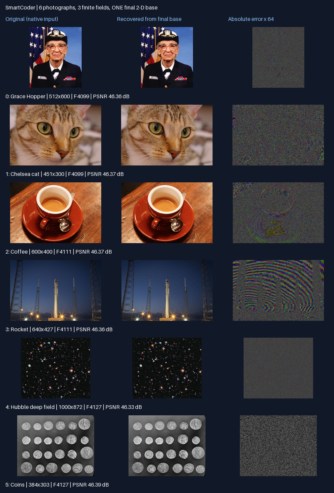

# 二维照片记忆实测结果 — v0.3.0

2026-09-06；按 PLAN_2D.md 的预注册阈值运行。研究依据见 RESEARCH_2D.md。

## 结论

H1–H7 全部通过：六张照片写入同一个二维 base，三个固定素域各返回两张，原生尺寸恢复；存储运算不增加量化之外的损失。

base 为 [872, 3000] 的 uint64 矩阵，素数 [4099, 4111, 4127]，M=69544031603，CRT 权重=[1034931917, 63386399031, 5122700656]。

| 照片 | 尺寸 W×H | 域 | 最大通道误差 | PSNR dB | 零 base MSE |
|---|---|---|---|---|---|
| Grace Hopper | 512×600 | F4099 | 2 | 46.3623 | 11684.52 |
| Chelsea cat | 451×300 | F4099 | 2 | 46.3723 | 14624.99 |
| Coffee | 600×400 | F4111 | 2 | 46.3707 | 14822.57 |
| Rocket | 640×427 | F4111 | 2 | 46.3580 | 5212.23 |
| Hubble deep field | 1000×872 | F4127 | 2 | 46.3347 | 1060.83 |
| Coins | 384×303 | F4127 | 2 | 46.3910 | 11793.84 |

## 验证记录

- H1：全部量化数字零误差，所有图保持尺寸和比例；误差上界 2，理论 PSNR 下界 42.1102 dB。JPEG 输入以本地解码后的 RGB 为真值，不声称恢复拍摄时未压缩原片。硬币灰度图转 RGB，三通道相同。
- H2：三个域、三个固定映射；每个映射输出两张，没有逐照片权重。参数仅 Q、素数、固定槽顺序、尺寸。
- H3：六个槽各测试 8×9 ROI，仅读写 216 个 base cell；其他所有像素与其他五张图逐值保持。完整对照扫描属于验证，不计入写入算法。
- H4：批量构建、正序六次整图写入、逆序六次整图写入完全一致；六个槽分别整图替换均无串扰。整图写入触及 3hw 个 cell。最终保存的 base 保持原六张照片，改动实验用副本。
- H5：新 Python -I 进程，显式添加本机 NumPy/Pillow 安装路径及 bundle；拒绝原图目录访问，主动负对照被阻止，decoder 对原图读取尝试为 0。网络审计守卫启用。此钩子是测试证据，不是操作系统级隔离。
- H6：64 小状态、384 次单槽更新、1000 个 Python 大整数对照通过；加上实际实现的不同尺寸、顺序、ROI 与非法输入测试。
- H7：零 base 无法达到原图 MSE≤4；真正 base 全部达到。此对照只排除本数据上的空状态伪恢复。

## 存储与代价（字节）

| 项目 | 字节 |
|---|---|
| base_payload_bytes | 20928000 |
| base_npy_bytes | 20928128 |
| manifest_bytes | 478 |
| decoder_source_bytes | 6805 |
| audit_harness_bytes | 1309 |
| input_rgb_bytes | 5832396 |
| direct_quantized_uint8_bytes | 5832396 |
| direct_quantized_bitpacked_lower_bytes | 4374297 |
| dense_crt_bitpacked_lower_bytes | 11777627 |
| download_bytes | 1484814 |

uint64 base / 原始 RGB = 3.588 倍。当前没有证明压缩优势。理论位打包下界并非已实现文件大小。

base 每次完整域解码读取所有 cell，返回两张图；不是按内容关联查找。载入/构造时做一次全 base 合法性检查，之后 ROI 操作不重复全扫描。临时余数约 8×cell 数字节，转换/取模重叠可约 16×cell 数，加输出及校验数组；不是实测峰值内存。局部更新的临时空间随 ROI 增长。没有宣称磁盘页级局部 I/O 或性能领先。

dense_crt_bitpacked_lower_bytes 是允许所有 M 种 cell 状态时的稠密表示计数下界，不利用合法照片码字/填充约束；不是本照片集的最低存储量，也不是已实现压缩器。原始下载文件已有 JPEG/PNG 编码；其大小与 RGB 字节数不是同一基准。

## 复现

从 SmartCoder 目录运行：

```sh
python3 -m unittest discover -s . -p test_memory2d.py -v
python3 verify_base_case.py
python3 run_photo_demo.py
# 独立复制 bundle 后，在装有 NumPy/Pillow 的环境恢复：
python3 artifacts/photo_demo/bundle/memory2d.py artifacts/photo_demo/bundle /tmp/smartcoder-recovered
```

运行器不会重新下载照片；输入哈希不符立即失败。data/sources.json 是下载清单，metrics.json 保存本次实际 SHA256、原始模式、运行时版本与 bundle 哈希。

## 实现调试记录

首轮独立进程启动失败：-I 不加载本机用户 site-packages，无法导入 NumPy。修正为显式加入已安装 NumPy/Pillow 的路径；没有放开原图读取或改动 H1–H7 阈值，随后重跑完整实验。

## 边界与下一阶段

这是受约束的二维编码记忆，不是智能涌现。单个域只读出其两张照片，不具有对完整 base 的单射性；原始 8 位像素因量化也不是单射。固定尺寸，增加记忆或域需要另行研究与容量/溢出设计。当前没有纠错、自动定位变化、联想检索、学习 decoder 或跨照片内容压缩。


